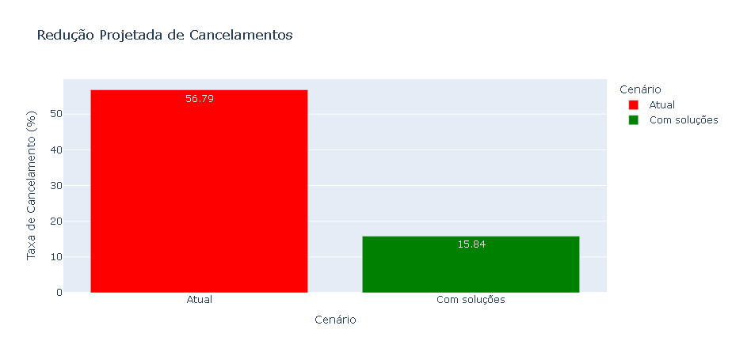

# 📊 Análise de Churn: Redução de Cancelamentos em Empresa de Serviços 


Projeto de Iniciação (Junho/2025) - Revisado e Atualizado (Março/2026)

[🇧🇷 Português](#-português) | [🇺🇸 English](#-english)

---
## 🇧🇷 Português

Este projeto analisa uma amostra de 50.000 clientes para identificar os principais motivos de cancelamento (churn) e propõe soluções estratégicas baseadas em dados para a retenção da base.


### 🎯 O Desafio de Negócio
A empresa apresenta uma taxa de cancelamento elevada. O objetivo desta análise foi identificar os "vilões" do cancelamento e calcular o impacto real de possíveis intervenções no atendimento e no faturamento.

### 🛠️ Tecnologias e Ferramentas

* **Python 3.10**: (Ambiente Virtual `venv`)

* **Pandas**: Limpeza e manipulação de grandes volumes de dados.

* **Plotly Express**: Visualizações interativas para descoberta de padrões.

* **Jupyter Notebook**: Ambiente de desenvolvimento e documentação.

### 📊 Insights Principais
Durante a análise exploratória, foram identificados três padrões críticos:

- Gargalo no Call Center: Clientes que precisam ligar 4 ou mais vezes para o suporte apresentam uma taxa de cancelamento próxima de 100%. Isso indica uma falha grave na resolução de problemas no primeiro contato.

- Inadimplência Crítica: Clientes com atrasos superiores a 20 dias entram em um ciclo de cancelamento inevitável se não houver uma intervenção de cobrança amigável ou negociação.

- Tipo de Contrato: Planos mensais possuem uma rotatividade muito superior aos planos mais longos.

### 🚀 Solução Proposta e Projeção de Resultados

Diferente de abordagens tradicionais que apenas filtram os erros, este projeto utiliza uma Simulação de Retenção. Ao tratar os clientes insatisfeitos com o Call Center e regularizar os pagamentos em atraso, os resultados projetados são:

* Taxa de Cancelamento Original: 56.79%

* Taxa de Cancelamento Projetada: 15.84%

* Redução Real: 40.96 pontos percentuais de retenção.


### 📱 Representação Visual dos Resultados

  


### 📈 Evolução e Autocrítica
Este repositório é um registro da minha transição de carreira para TI. A versão original (2025) focava na limpeza técnica dos dados. Na revisão de 2026, adicionei a camada de Inteligência de Negócio, transformando linhas de código em insights acionáveis e projeções de lucro para a organização.

### 📂 Estrutura do Repositório

A organização das pastas reflete as boas práticas de desenvolvimento que utilizei para isolar o ambiente e os dados:

    ```
    ├── data/                       # Pasta contendo os datasets
    │   └── cancelamentos_sample.csv # Base de dados (Amostra de 50.000 clientes)
    ├── venv/                       # Ambiente virtual (Omitido no GitHub via .gitignore)
    ├── inicial.ipynb               # Notebook principal com a análise e gráficos
    ├── requirements.txt            # Dependências para reprodução do ambiente
    └── README.md                   # Documentação e insights do projeto
    ```

### 🚀 Como Executar o Projeto

Este projeto utiliza um ambiente virtual (venv) para garantir que as versões das bibliotecas sejam exatamente as mesmas utilizadas no desenvolvimento.

1. Clonar o repositório:
    ```
    git clone https://github.com/helensjferreira-dev/analise-dados-cancelamentos.git
    cd nome-do-projeto
    ```

2. Criar e ativar o ambiente virtual:
    ```
    python -m venv venv
    .\venv\Scripts\activate
    ```

3. Instalar as dependências:
    ```
    pip install -r requirements.txt
    ```

4. Configurar o Kernel no VS Code:
    * Abra o arquivo inicial.ipynb.

    * No canto superior direito, clique em Select Kernel.

    * Escolha o interpretador Python que aponta para a pasta .\venv\Scripts\python.exe.  


5. Executar: 
    * Clique em Run All para processar os dados e visualizar os gráficos interativos do Plotly.


### 📄 Licença

Este projeto está sob a licença MIT. Veja o arquivo LICENSE para mais detalhes.

---

## 🇺🇸 English

This project analyzes a sample of 50,000 customers to identify the main reasons for cancellation (churn) and proposes data-driven strategic solutions for customer retention.

### 🎯 Business Challenge
The company faces a high churn rate. The goal of this analysis was to identify the "villains" behind these cancellations and calculate the real impact of potential interventions in customer service and billing.

### 🛠️ Technologies and Tools

* **Python 3.10**: (Virtual Environment `venv`)

* **Pandas**: Cleaning and manipulation of large data volumes.

* **Plotly Express**: Interactive visualizations for pattern discovery.

* **Jupyter Notebook**: Development environment and documentation.

### 📊 Main Insights
During the exploratory analysis, three critical patterns were identified:

- Call Center Bottleneck: Customers who need to call support 4 or more times have a cancellation rate near 100%. This indicates a serious failure in First Contact Resolution (FCR).

- Critical Delinquency: Customers with payment delays exceeding 20 days enter an inevitable cancellation cycle without a friendly billing intervention or negotiation.

- Contract Type: Monthly plans have a significantly higher turnover rate compared to longer-term plans.

### 🚀 Proposed Solution and Results Projection

Unlike traditional approaches that merely filter out errors, this project uses a Retention Simulation. By addressing customers dissatisfied with the Call Center and regularizing overdue payments, the projected results are:

* Original Churn Rate: 56.79%

* Projected Churn Rate: 15.84%

* Actual Reduction: 40.96 percentage points in retention.

### 📱 Visual Representation of Results

  


### 📈 Evolution and Self-Criticism
This repository is a record of my career transition into IT. The original version (2025) focused on the technical cleaning of data. In the 2026 revision, I added a layer of Business Intelligence, transforming lines of code into actionable insights and profit projections for the organization.

### 📂 Repository Structure

The folder organization reflects the development best practices used to isolate the environment and data:

    ```
    ├── data/                       # Folder containing the datasets
    │   └── cancelamentos_sample.csv # Database (Sample of 50,000 customers)
    ├── venv/                       # Virtual environment (Omitted on GitHub via .gitignore)
    ├── inicial.ipynb               # Main notebook with analysis and charts
    ├── requirements.txt            # Dependencies for environment reproduction
    └── README.md                   # Project documentation and insights
    ```

### 🚀 How to Run the Project

This project uses a virtual environment (venv) to ensure that library versions are exactly the same as those used during development.

1. Clone the repository:

    ```
    git clone https://github.com/helensjferreira-dev/analise-dados-cancelamentos.git
    cd project-name
    ```

2. Create and activate the virtual environment:

    ```
    python -m venv venv
    .\venv\Scripts\activate
    ```

3. Install dependencies:

    ```
    pip install -r requirements.txt
    ```

4. Configure the Kernel in VS Code:
    * Open the inicial.ipynb file.

    * In the top right corner, click Select Kernel.

    * Choose the Python interpreter pointing to the .\venv\Scripts\python.exe folder.

5. Run: 
    * Click Run All to process the data and view the interactive Plotly charts.

### 📄 License

This project is under the MIT license. See the LICENSE file for more details.

---
👤 Author / Autora  
Hélen Ferreira – Developer  
📸 [Linkedin](https://www.linkedin.com/in/helensjferreira-dev/)  
💬 [WhatsApp](https://wa.me/5548988183720)  
🔗 [GitHub](https://github.com/helensjferreira-dev/assistente-esportivo)  
